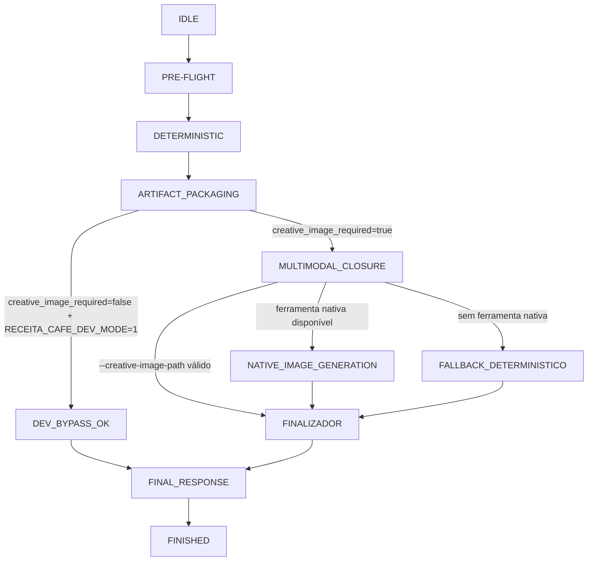

# 📖 Guia de Uso: Advanced Brazilian Coffee Engine (v3.1.0)

Esta skill orquestra o preparo de cafés especiais brasileiros, unindo a ciência da extração com a arte do barismo.

## 📥 Pré-requisitos & Instalação

Para que o motor visual e os cálculos técnicos funcionem corretamente, sua estação de trabalho (ou o ambiente do Agente) precisa:

1.  **Python 3.8+** instalado.
2.  **Biblioteca Pillow:** Responsável pela geração dos infográficos.

### ✅ Validação de Dependências (Fail Fast)
O runtime valida se o **Pillow** está disponível antes da renderização visual.  
Se estiver ausente, a execução falha com instruções explícitas de instalação.

Exemplos de instalação:
1.  Ubuntu/Debian: `sudo apt install python3-pil`
2.  Ambiente virtual: `pip install Pillow`

---

## 🔄 Fluxo de Inteligência (Engine Lifecycle)

O diagrama abaixo ilustra o ciclo de vida de uma extração. Este formato em **Unicode Art** garante a visualização correta em qualquer editor, terminal ou ambiente Git.

```text
┌────────────────┐     ┌──────────────────┐     ┌─────────────────────┐
│ Pedido Inicial │────▶│ Validação Terroir│────▶│ Sugestão de Setup   │
└────────────────┘     └─────────┬────────┘     └──────────┬──────────┘
                                 │                         │ 
                       (Mogiana/Cerrado)        (Ratio/Moagem/Água)
                                 │                         │
                                 ▼                         ▼
┌────────────────┐     ┌──────────────────┐     ┌─────────────────────┐
│ ✅ Café Final  │◀────│ Feedback Tempo   │◀────│ Execução Blooming   │
└────────────────┘     └─────────┬────────┘     └─────────────────────┘
                                 │
                        (Lento/Rápido?)
                                 │
                                 ▼
                       [Ajuste de Moagem]
```

---

## ⚙️ Engenharia de Escala (Auto-Scaling Dose)

A versão 3.1.0 introduz a **Engenharia de Escala**, tratando a dose de café como um recurso elástico. O sistema agora gerencia a relação entre o número de pessoas e os insumos técnicos (pó/água).

### 📊 Fluxo de Dados e Cálculo
Para um desenvolvedor júnior, imagine isso como um **Microserviço de Dosagem**:

```text
    USER INPUT                  AGENT REASONING                ENGINE CALC (Python)
  ┌──────────────┐          ┌─────────────────────┐          ┌──────────────────────┐
  │ "Reunião de  │─────────▶│ Inferência:         │─────────▶│ volume = pessoas * 150│
  │  5 pessoas"  │          │ num_pessoas = 5     │          │ pó = volume * ratio  │
  └──────────────┘          └──────────┬──────────┘          └──────────┬───────────┘
                                       │                                │
                                       ▼                                ▼
                            ┌─────────────────────┐          ┌──────────────────────┐
                            │ STORYTELLING ARG:   │◀─────────│ OUTPUTS:             │
                            │ --story "Contexto.."│          │ - Infográfico (PNG)  │
                            └─────────────────────┘          │ - Protocolo (MD)     │
                                                              └──────────────────────┘
```

**Regras de Negócio aplicadas:**
*   **Default Unit:** 150ml por pessoa (uma dose padrão de café especial).
*   **Inferência Inteligente:** Se você disser "Quero um café", o agente assume `1 pessoa`. Se for uma `reunião`, o agente suspende a execução para perguntar o quorum, garantindo que não falte café no seu "deploy".

---

### 🧠 Visão de Estados (Complementar)

Para visualizadores que suportam Mermaid (GitHub/VS Code):



> 🖼️ **Visual Check:** Se o seu visualizador suportar imagens locais, consulte o infográfico detalhado em: `./assets/flowchart.png`

---

## 🖼️ Galeria de Outputs Visuais (Novo!)

A skill agora conta com um **motor de infográficos criativos** (v3.1). Cada cenário de desenvolvimento possui uma identidade visual única, agora com um layout expandido de **5 métricas**.

**O que há de novo no Infográfico:**
*   **Card de PESSOAS:** Indica claramente para quantos "usuários" a receita foi escalonada.
*   **Grid de 5 Colunas:** Layout otimizado para PESSOAS, CAFÉ, ÁGUA, TEMP e MOAGEM.
*   **Storytelling embutido:** O texto rico e motivacional gerado pela IA agora é injetado no rodapé e no documento Markdown através do parâmetro `--story`.

| Cenário | Preview Visual | Mood / Aplicação |
| :--- | :--- | :--- |
| **Debugging** | `.ia/output/cafe_debugging_*.png` | War Room, Tensão, Resiliência. |
| **Deploy** | `.ia/output/cafe_deploy_*.png` | Celebração, Vitória, Pipeline Verde. |
| **Team Topologies** | `.ia/output/cafe_team_topologies_*.png` | Alinhamento, Fluxos, Estrutura. |
| **Planning** | `.ia/output/cafe_planning_*.png` | Foco, Estratégia, Equilíbrio. |
| **Code Review** | `.ia/output/cafe_code_review_*.png` | Precisão, Limpeza, Análise Técnica. |
| **Doc Mode** | `.ia/output/cafe_documentation_*.png` | Conforto, Contemplação, Foco. |

*Os arquivos são gerados no diretório `.ia/output/` e seguem o padrão de nomenclatura `cafe_[cenario]_[timestamp].png`.*

---

## 📊 Barista Analytics (Observabilidade)

A partir da v4.0.0, sua skill não apenas faz café, ela **observa** seu time. Cada extração bem-sucedida é registrada em um banco de dados local (`data/history.json`).

### O que o Analytics rastreia?
*   **Stress Metrics:** Frequência de cenários como `incident` e `debugging`.
*   **Resource Management:** Total de litros e gramas de café consumidos.
*   **Impacto Humano:** Quantas pessoas foram servidas pelo Agente.

### Como gerar seu Dashboard?
Você pode solicitar um balanço do histórico a qualquer momento. O Agente gerará um infográfico exclusivo de dashboard:

**Comando:**
```bash
python3 scripts/validar_cafe.py --dashboard
```

> 🎭 **Humor Barista:** Se o dashboard apontar muitos `incidents`, o sistema sugerirá automaticamente um grão com maior doçura para acalmar os ânimos!

---

## 🚀 Como Usar (Prompt-First)

A forma recomendada de usar esta skill é através da **interface de chat** com o Agente de IA. O agente utiliza o `SKILL.md` como cérebro para entender seu pedido e o motor Python para gerar o visual.

### 1. Pedido com Visual (Recomendado)
**Prompt:** *"Pode me sugerir um café para debugging e gerar o infográfico de preparo?"*
> O Agente calculará os parâmetros e invocará o motor visual, retornando o caminho da imagem e as instruções.
> 
> ✨ **Novo:** O Agente agora está instruído a incluir automaticamente o link e a renderização da imagem ao final de cada sugestão visual.

### Runtime Completo Obrigatório
Para pedidos de receita completa, sugestão de café para cenário, reunião/time ou visualização, o Agente deve executar o wrapper canonico. Isso evita o uso apenas conceitual da skill e garante Flow Tracer, PNG tecnico, Markdown portatil, prompt criativo rastreavel e manifesto de runtime.

**Comando recomendado:**
```bash
python3 scripts/receita_completa.py --cenario team_topologies --pessoas 8
```

O wrapper falha a execução se algum item essencial não for encontrado:
*   Flow Tracer real (`[FLOW]`).
*   Infografico tecnico em `.ia/output/cafe_[cenario]_[timestamp].png`.
*   Markdown portatil em `.ia/output/receita_[cenario]_[timestamp].md`.
*   Imagem embutida no Markdown via `data:image/png;base64`.
*   Prompt criativo persistido em `.ia/output/prompt_criativo_[cenario]_[timestamp].txt`.
*   Manifesto persistido em `.ia/output/runtime_manifest_[cenario]_[timestamp].json`.
*   Flow Trace JSONL, JSON e HTML persistidos em `.ia/output/flow_trace_[cenario]_[timestamp].*`.
*   Links de telemetria inseridos no Markdown portatil.

Resumo de entrega obrigatório na resposta do runtime:

```text
[RESUMO_ENTREGA]
- Markdown portátil: <caminho absoluto>
- Infográfico técnico: <caminho absoluto>
- Imagem criativa: <caminho absoluto> ou pendente (destino sugerido)
```

Esse bloco deve aparecer mesmo quando houver pendência multimodal, para deixar claro o que já foi gerado e o que falta.

### Quando usar cada script (sem ambiguidade)

| Script | Use quando... | Não use quando... |
| :--- | :--- | :--- |
| `scripts/receita_completa.py` | Você precisa da jornada completa: cálculo + infográfico técnico + markdown portátil + prompt criativo + manifesto + fechamento multimodal. | Você quer apenas um teste rápido de cálculo sem orquestração completa. |
| `scripts/validar_cafe.py` | Você quer validar rapidamente parâmetros técnicos, JSON, dashboard ou geração pontual de artefatos. | Você precisa do contrato completo de runtime com gate multimodal e bloqueio de conclusão. |
| `scripts/finalizar_imagem_criativa.py` | Você já possui manifesto pendente + PNG criativo e quer fechar o contrato multimodal. | Você ainda não executou o runtime completo para gerar manifesto. |

### Parâmetros Canônicos (CLI)
Tabela de referência rápida para saber o que cada opção faz e onde ela se aplica.

| Parâmetro | Onde aplica | Default | Obrigatório | Exemplo |
| :--- | :--- | :--- | :--- | :--- |
| `--cenario` | `receita_completa.py`, `validar_cafe.py` | sem default | Sim (no runtime completo) | `--cenario incident` |
| `--pessoas` | `receita_completa.py`, `validar_cafe.py` | `1` no `validar_cafe.py` | Sim (no runtime completo) | `--pessoas 6` |
| `--ml` | ambos | inferido por pessoas (`pessoas * 150`) | Não | `--ml 900` |
| `--regiao` | ambos | inferida pelo cenário | Não | `--regiao Cerrado` |
| `--temp` | ambos | inferida por matriz de terroir | Não | `--temp 94` |
| `--tempo` | ambos | inferido por perfil de extração | Não | `--tempo 210` |
| `--tds_agua` | ambos | `100` (recomendado) | Não | `--tds_agua 120` |
| `--story` | ambos | vazio | Não | `--story "War room com foco"` |
| `--flow` | `validar_cafe.py` | ativo por padrão | Não | `--flow` |
| `--imagem` | `validar_cafe.py` | `false` | Não | `--imagem` |
| `--markdown` | `validar_cafe.py` | `false` | Não | `--markdown` |
| `--json` | `validar_cafe.py` | `false` | Não | `--json` |
| `--dashboard` | `validar_cafe.py` | `false` | Não | `--dashboard` |
| `--artifacts-json` | `validar_cafe.py` | `false` | Não | `--artifacts-json` |
| `--creative-image-required` / `--no-creative-image-required` | `receita_completa.py` | `true` | Não | `--no-creative-image-required` (somente dev) |
| `--creative-image-path` | `receita_completa.py` | vazio | Não | `--creative-image-path .ia/output/imagem.png` |
| `--chat-telemetry` / `--no-chat-telemetry` | `receita_completa.py` | `true` | Não | `--no-chat-telemetry` |
| `--chat-telemetry-style` | `receita_completa.py` | `friendly` | Não | `--chat-telemetry-style technical` |
| `--manifest` | `receita_completa.py` | `false` | Não | `--manifest` |

### Regras de Inferência por Prompt (Prompt-First)
Quando o usuário pede em linguagem natural, o agente converte o pedido em parâmetros efetivos.

1. Pedido singular (ex.: "faz um café para mim"):
- Inferência: `pessoas=1`.
- Se `ml` não for informado: `ml=150`.

2. Pedido de reunião/time sem quantidade explícita:
- O agente deve perguntar: "Para quantas pessoas será o café?" antes de executar.
- Não deve assumir volume alto sem quorum.

3. Pedido com pessoas explícitas (ex.: "15 pessoas"):
- Inferência: `ml = pessoas * 150`.
- Exemplo: `15 pessoas -> ml=2250`.

4. Pedido por cenário (ex.: debugging, incident, planning):
- `cenario` é definido pelo contexto textual.
- `regiao`, `temp` e `tempo` podem ser inferidos pela matriz sensorial/técnica.

5. Pedido explícito de visual/infográfico:
- O agente deve usar runtime completo (`receita_completa.py`) para garantir rastreabilidade e artefatos.

6. Pedido com imagem criativa obrigatória:
- `creative_image_required=true` (padrão).
- Só concluir resposta final com `completion_allowed=true`.

### Matriz Didática: Tipo de Pedido -> Parâmetros Efetivos

| Pedido do usuário (exemplo) | Parâmetros efetivos esperados |
| :--- | :--- |
| "Quero um café para codar agora." | `cenario=debugging`, `pessoas=1`, `ml=150` |
| "Sugira café para reunião de arquitetura com 6 pessoas." | `cenario=planning`, `pessoas=6`, `ml=900` |
| "Tem incidente em produção, somos 3 devs." | `cenario=incident`, `pessoas=3`, `ml=450` |
| "Planejamento trimestral com 15 líderes, quero infográfico." | `cenario=planning`, `pessoas=15`, `ml=2250`, runtime completo obrigatório |
| "Faça um café do Cerrado, 300ml, mais intenso." | `regiao=Cerrado`, `ml=300`, possível ajuste `temp=94` |
| "Só quero validar o cálculo em JSON." | usar `validar_cafe.py` com `--json` |
| "Quero receita completa com manifesto e trace." | usar `receita_completa.py` com `--manifest` |
| "Já tenho a imagem criativa, só fechar agora." | `receita_completa.py --creative-image-path ...` ou `finalizar_imagem_criativa.py --manifest ... --creative-image-path ...` |

### Telemetria Didatica Obrigatoria
A rastreabilidade nao e opcional nesta skill. Cada execucao completa gera tres camadas de observabilidade:

1. **Tempo real no console:** eventos `[FLOW]` mostram o que esta acontecendo enquanto a skill roda.
2. **Auditoria estruturada:** `flow_trace_*.jsonl` e `flow_trace_*.json` registram decisoes, arquivos usados e artefatos.
3. **Visualizacao amigavel:** `flow_trace_*.html` renderiza uma timeline com fases, status, decisoes, recursos e outputs.

O manifesto referencia esses tres arquivos, e o Markdown portatil inclui uma secao `Telemetria da Execução` com links para eles.

### Mapeamento de Marcos (Chat x Trace)
Para auditoria rapida, use a tabela abaixo como contrato entre experiencia no chat e evidencias tecnicas no Flow Trace:

| Marco Canonico | Mensagem no Chat (exemplo) | Evento no Trace (esperado) |
| :--- | :--- | :--- |
| `PRE-FLIGHT` (`PREPARACAO` no chat) | `[PREPARACAO][ORQUESTRADOR][INICIAR][INFO] Inicializando execução canônica da skill.` | `runtime_start`, `command_built` |
| `DETERMINISTIC` (`EXECUCAO_DETERMINISTICA` no chat) | `[EXECUCAO_DETERMINISTICA][SCRIPT][EXECUTAR][INFO] Executando validar_cafe.py com flow...` | `início_da_skill`, `análise_de_contexto`, `cálculo_de_extração`, `inferência_de_volume`, `persistência_de_dados`, `renderização_visual` |
| `ARTIFACT_PACKAGING` (`EMPACOTAMENTO_ARTEFATOS` no chat) | `[EMPACOTAMENTO_ARTEFATOS][RASTRO_EXECUCAO][VALIDAR][INFO] Rastro de execução real validado=sim.` | `empacotamento`, `artifacts_detected`, `manifest_written` |
| `MULTIMODAL_CLOSURE` (`FECHAMENTO_MULTIMODAL` no chat) | `[FECHAMENTO_MULTIMODAL][PORTAO][DECIDIR][INFO/WARN] estado=... conclusao_permitida=...` | `creative_image_state`, `creative_image_auto_resolved`, `creative_image_finalized` (quando fechado) |
| `FINAL_RESPONSE` (`RESPOSTA_FINAL` no chat) | `[RESPOSTA_FINAL][ORQUESTRADOR][CONCLUIR][INFO] Resposta final liberada.` | consolidado no manifesto final (`status=ok`, `completion_allowed=true`) + ultimo evento de fechamento multimodal |

Regra de consistencia: cada marco exibido no chat deve ter evento correlato no Flow Trace e refletir o mesmo estado no manifesto JSON.

### Runtime de Imagem Criativa
A imagem criativa e uma fase **agent-native**: o Python prepara o prompt e o manifesto; o Agente executa a ferramenta nativa de imagem e finaliza o contrato.

Fluxo esperado:
1. Execute `scripts/receita_completa.py`.
2. Leia `creative_prompt_path` no manifesto.
3. Gere a imagem criativa com a ferramenta nativa de imagem.
4. Copie o PNG para `suggested_creative_image_path`.
5. Finalize o manifesto:
   ```bash
   python3 scripts/finalizar_imagem_criativa.py \
     --manifest .ia/output/runtime_manifest_<cenario>_<timestamp>.json \
     --creative-image-path .ia/output/imagem_criativa_<cenario>_<timestamp>.png
   ```

Uma entrega multimodal so esta completa quando o manifesto retornar `status: "ok"`, `completion_allowed: true`, `multimodal_status: "ok"` e `creative_image_path` apontar para um PNG existente.

Se `scripts/receita_completa.py` retornar `status: "pending_multimodal"`, o Agente nao deve responder ainda. Ele deve seguir `agent_next_action`, gerar a imagem criativa com a ferramenta nativa de imagem, salvar no `suggested_creative_image_path` e executar `scripts/finalizar_imagem_criativa.py`.

### Opções Multimodais (Guia Objetivo)

| Opção | Comportamento |
| :--- | :--- |
| `--creative-image-required` (padrão) | Exige fechamento multimodal completo antes da resposta final. |
| `--no-creative-image-required` | Bypass apenas para desenvolvimento com `RECEITA_CAFE_DEV_MODE=1`. |
| `--creative-image-path <png>` | Usa PNG criativo já pronto para finalizar automaticamente no mesmo run. |
| Sem ferramenta nativa de imagem | O runtime tenta fallback determinístico para não quebrar a esteira. |

Checklist multimodal de sucesso:
1. `creative_image_path` existe e aponta para `.png`.
2. `multimodal_status="ok"`.
3. `completion_allowed=true`.
4. `completion_block_reason=null`.

### Controle do Bypass Criativo (Modo Dev)
O bypass `--no-creative-image-required` e aceito apenas em desenvolvimento com:

```bash
RECEITA_CAFE_DEV_MODE=1 python3 scripts/receita_completa.py --cenario debugging --pessoas 2 --no-creative-image-required
```

Sem `RECEITA_CAFE_DEV_MODE=1`, o wrapper rejeita o bypass.

### Padrões e Fallbacks (Resumo Executivo)
Padrões operacionais para evitar ambiguidade:

1. Pessoas:
- Prompt singular -> `pessoas=1`.
- Reunião sem quorum -> perguntar antes de executar.

2. Volume:
- Se `ml` ausente -> `ml = pessoas * 150`.

3. Saída:
- Artefatos e manifesto sempre em `.ia/output`.

4. Telemetria:
- `--chat-telemetry` ativo por padrão.
- Flow trace real é requisito de conclusão.

5. Multimodal:
- Padrão é obrigatório (`creative_image_required=true`).
- Se pendente, não finalizar resposta ao usuário.

### Copiar e Rodar (por perfil)

1. Iniciante (resultado completo recomendado):
```bash
python3 scripts/receita_completa.py --cenario planning --pessoas 6 --manifest
```

2. Líder técnico (fornecendo imagem criativa já pronta):
```bash
python3 scripts/receita_completa.py \
  --cenario incident \
  --pessoas 3 \
  --creative-image-path .ia/output/imagem_criativa_incident_exemplo.png \
  --manifest
```

3. Automação/CI (modo determinístico validável):
```bash
RECEITA_CAFE_DEV_MODE=1 python3 scripts/receita_completa.py \
  --cenario debugging \
  --pessoas 2 \
  --no-creative-image-required \
  --manifest
```

### 2. Pedido Baseado em Cenário (Consultoria)
**Prompt:** *"Estou em uma sessão crítica de deploy e preciso de café para 2 pessoas. O que você sugere?"*

### 3. Ajuste de Extração
**Prompt:** *"Meu último café ficou amargo. Como ajusto a moagem para 300ml de Sul de Minas?"*

---

## ✅ Verificação Técnica e Automação

Para desenvolvedores e automações, a skill pode ser invocada via terminal:

**Comando de Validação (Modo Visual):**
```bash
python3 scripts/receita_completa.py --cenario debugging --pessoas 2
```

**Comando direto do motor base:**
```bash
python3 scripts/validar_cafe.py --ml 250 --cenario debugging --flow --imagem --markdown
```

**Comando de Validação (Modo JSON):**
```bash
python3 scripts/validar_cafe.py --ml 250 --cenario debugging --json
```

### 🛤️ Rastreabilidade Didática (NOVO!)
A v4.1.0 introduz o parâmetro `--flow`. Este modo é focado no ensino, permitindo visualizar as decisões da IA e os recursos acessados em tempo real.

**Comando:**
```bash
python3 scripts/validar_cafe.py --cenario team_topologies --flow
```

### Como Ler o Manifesto (Guia Rápido)
Campos mínimos para tomada de decisão:

| Campo | Significado prático | Regra |
| :--- | :--- | :--- |
| `status` | Estado global do run (`ok`, `pending_multimodal`, `failed`) | Só concluir quando `ok`. |
| `completion_allowed` | Liberação da resposta final | Deve ser `true` para responder. |
| `completion_block_reason` | Motivo explícito de bloqueio | Se preenchido, seguir `agent_next_action`. |
| `agent_next_action` | Próximo passo recomendado pelo runtime | Executar antes de responder no chat. |
| `artifacts.creative_image_path` | Caminho final da imagem criativa | Deve existir quando multimodal é obrigatório. |
| `flow_trace_real_validated` | Validação do trace real | Deve ser `true` na entrega completa. |

Leitura operacional:
1. Verifique `completion_allowed`.
2. Se `false`, leia `completion_block_reason` e `agent_next_action`.
3. Só publique resposta final depois que o manifesto estiver consistente.

### FAQ (Prompt x CLI x Multimodal)

1. "Pedir no chat muda os parâmetros?"
- Sim. O agente infere `cenario`, `pessoas` e eventualmente `ml`, depois converte para CLI.

2. "Quando usar `validar_cafe.py` em vez de `receita_completa.py`?"
- `validar_cafe.py` para validação técnica pontual; `receita_completa.py` para contrato fim a fim.

3. "Posso ignorar imagem criativa?"
- Apenas em modo dev com `RECEITA_CAFE_DEV_MODE=1` e `--no-creative-image-required`.

4. "Recebi `pending_multimodal`; e agora?"
- Gere/forneça PNG criativo e finalize com `finalizar_imagem_criativa.py`.

5. "O que garante que o trace é real?"
- `flow_trace_real_validated=true` + presença de `jsonl/json/html` no manifesto.

---

## 🤖 O Agente Autônomo: Validação nos Bastidores

Nesta skill, a IA não é apenas um chatbot; ela é um **operador técnico**. Veja como o Agente utiliza o motor de validação de forma autônoma:

### Cenário: "O Sentinela do Café" (Double-Check Automático)

*O desenvolvedor pede um café para uma sessão de debugging, mas menciona que a água acabou de ferver.*

1.  **O Gatilho:** Você diz: *"Barista, vou fazer um café para debugging agora. A água já ferveu, posso colocar?"*
2.  **A Análise Interna:** O Agente lê seu pedido e identifica o risco térmico (água fervente). No `SKILL.md`, ele vê que existe uma ferramenta de validação.
3.  **A Execução Silenciosa (Tool Call):** Antes de te responder, o Agente executa internamente:
    ```bash
    python3 scripts/validar_cafe.py --ml 300 --cenario debugging --temp 100 --json
    ```
4.  **O Processamento do Erro:** O script retorna um JSON informando: `"status": "FAILED", "errors": ["Água fervente detectada..."]`.
5.  **A Resposta Inteligente:** Em vez de apenas dizer "não use água quente", o Agente entrega uma solução embasada:
    > "Espere um momento! Acabei de rodar meu motor de validação e detectamos que 100°C vai queimar seu Cerrado. Deixe a água descansar por 60 segundos para atingirmos os 94°C ideais para o seu debugging. Enquanto isso, prepare os 25g de café."

*Este ciclo demonstra o Agente usando **Raciocínio + Ferramenta** para evitar falhas no mundo real.*

---

## 🎭 A Jornada do Café: O Ciclo de Vida do Desenvolvedor

Na engenharia de software, o café não é apenas energia; é um **estado mental**. Esta skill foi desenhada para acompanhar as flutuações de foco do seu time.

### 🧪 Cenário 1: O Sprint Planning (Equilíbrio e Foco)
*O time está reunido, as tasks ainda são estimativas e o backlog está limpo.*
*   **Necessidade:** Um café que traga clareza mental e doçura para as discussões críticas.
*   **Comando:** `"Barista, prepare uma Mogiana equilibrada para 6 pessoas (900ml)."`
*   **O Agente responde:** 
    > "Iniciando modo Planning. Aplicando Ratio 1:12 para destacar a doçura e notas de chocolate. Vamos calibrar para 75g de café moagem média-fina. Uma base sólida para um sprint promissor."

### 🐛 Cenário 2: O Bug em Produção (Resiliência e Punch)
*São 14h, um erro 500 está subindo nos logs e o time entrou em 'war room'.*
*   **Necessidade:** Intensidade, corpo e resistência. Um café que sustente o raciocínio sob pressão.
*   **Comando:** `"Preciso de um Cerrado intenso, 300ml, moagem para punch extra."`
*   **O Agente responde:**
    > "Modo War Room ativado. Reduzindo ratio para 1:11 e elevando temperatura para 94°C para extrair o máximo de corpo do Cerrado Mineiro. Diagnóstico extra: Verifique o TDS da água para evitar amargor excessivo sob alta temperatura."

### 🚀 Cenário 3: O Deploy de Sexta (Celebração e Nuances)
*A feature foi lançada, os testes passaram e o merge foi feito. Hora de apreciar a vitória.*
*   **Necessidade:** Complexidade sensorial. Um café ácido e vibrante para um momento de descontração.
*   **Comando:** `"Celebração: Sul de Minas, perfil frutado para um 'Done' bem feito."`
*   **O Agente responde:**
    > "Launch Mode! Aplicando a técnica de Sul de Minas (Ratio 1:15, 90°C). Vamos focar na acidez cítrica e corpo leve. Este é um café para ser apreciado lentamente enquanto os logs estabilizam no dashboard de monitoramento."

---

## 🛠️ Stack Tecnológica & Arquitetura

Esta skill foi construída sob o princípio da **Simplicidade Robusta**, utilizando ferramentas de alta performance e baixa dependência externa para garantir a portabilidade do Agente.

### 🧰 Tecnologias Core
*   **Python 3.x:** A linguagem base da inteligência técnica. Escolhida por sua expressividade em regras de negócio e vasta biblioteca de manipulação de dados.
*   **Pillow (PIL):** Motor de renderização do infográfico. Permite a criação dinâmica de composições 2D (gradientes, tipografia, ícones) sem a necessidade de bibliotecas pesadas de UI.
*   **Argparse & JSON:** Utilizados para criar uma interface de comando (CLI) limpa e permitir que o Agente de IA "converse" com o código de forma estruturada.

### 📂 Anatomia dos Scripts
1.  **`scripts/validar_cafe.py` (O Orquestrador):**
    *   **Papel:** Gerencia o *Business Logic* (matrizes de terroir e ratios).
    *   **Responsabilidade:** Realiza o cálculo de escala (Dose/Volume), validação de QA (alertas térmicos) e a geração do documento Markdown portátil.
2.  **`scripts/infografico_engine.py` (O Motor Visual):**
    *   **Papel:** Responsável pela *Presentation Layer*.
    *   **Responsabilidade:** Transforma o dicionário de parâmetros técnicos em um infográfico PNG com temas dinâmicos por cenário (War Room, Launch Mode, etc).
3.  **`scripts/receita_completa.py` (O Runtime Canonico):**
    *   **Papel:** Evita execucao conceitual da skill.
    *   **Responsabilidade:** Invoca `validar_cafe.py` com `--flow --imagem --markdown`, valida os artefatos obrigatorios e imprime/persiste um manifesto JSON com os caminhos finais.
4.  **`scripts/finalizar_imagem_criativa.py` (O Fechamento Multimodal):**
    *   **Papel:** Conecta a imagem gerada pelo Agente ao manifesto da skill.
    *   **Responsabilidade:** Valida o PNG criativo, preenche `creative_image_path` e muda `multimodal_status` para `ok`.

### 📐 Escolhas Arquiteturais (Design Decisions)
*   **Base64 Image Embedding:** Optamos por embutir as imagens via Base64 no Markdown. **Justificativa:** Isso torna o arquivo `.md` 100% autossuficiente (portátil), permitindo que ele seja compartilhado por e-mail ou Slack sem perder o infográfico.
*   **Isolamento de Responsabilidade:** Separar o cálculo (`validar_cafe.py`) da renderização (`infografico_engine.py`) segue o princípio **SOLID**, facilitando a criação de novos temas visuais sem quebrar a lógica de extração.
*   **Standard Lib First:** Priorizamos bibliotecas nativas do Python para reduzir o *Cold Start* e a necessidade de instalações complexas.

---

## 🏗️ Anatomia da Skill: Mergulho Técnico no `SKILL.md`

Como arquiteto sênior, vou decompor exatamente o que compõe o "cérebro" da nossa **Advanced Brazilian Coffee Engine**. O arquivo `SKILL.md` desta skill não apenas descreve o que ela faz, mas implementa as regras de negócio que o Agente segue rigorosamente.

### 1. O Contrato de Interface (Frontmatter YAML)
O topo do arquivo define a "API" da skill. É aqui que estabelecemos o que o Agente precisa receber (Input) e o que ele promete entregar (Output).

*   **Inputs Estruturados:** Note como definimos `volume_ml` como um inteiro (mínimo 150) e `regiao` como um `enum`. Isso evita que o Agente aceite entradas inválidas como "um pouquinho de café".
*   **Cenários de Negócio:** O campo `cenario` é a nossa "Feature Toggle" contextual. Ele permite que a lógica de preparo mude se você está em um `debugging` tenso ou em um `deploy` festivo.

```text
                          O CONTRATO DE INTERFACE
    ┌───────────────────────────┐         ┌───────────────────────────┐
    │   INPUT (Prompt/JSON)     │         │    BUSINESS LOGIC (SKILL) │
    │   - Volume: 150ml+        │────────▶│    - Terroir Matrix       │
    │   - Região: Mogiana...    │         │    - Regras de Barismo    │
    │   - Cenário: Debugging... │         │    - Diagnóstico de QA    │
    └───────────────────────────┘         └─────────────┬─────────────┘
                                                        │
                              ┌─────────────────────────┴────────────────────────┐
                              ▼                                                  ▼
                 [Cerrado + Debugging]                            [Mogiana + Planning]
                 Lógica: 94ºC | 1:15                              Lógica: 92ºC | 1:12
                 Punch & Resiliência                              Foco & Doçura
                              │                                                  │
                              └─────────────────────────┬────────────────────────┘
                                                        ▼
                                          ┌───────────────────────────┐
                                          │   OUTPUT (Resposta IA)    │
                                          │   - Setup de Extração     │
                                          │   - Insight Sensorial     │
                                          └───────────────────────────┘
```

### 2. A Matriz de Decisão (Terroir Matrix)
Diferente de um código `if/else` tradicional, a IA usa a tabela de **Terroir Matrix** no Markdown como um banco de dados de referência rápida:

*   **Lookup Dinâmico:** Se você seleciona **Sul de Minas**, o Agente lê na tabela que a temperatura alvo é **90°C** e a moagem deve ser **Média-Grossa**. Isso democratiza a expertise de barismo para o código.
*   **Notas Sensoriais:** O Agente usa os dados das notas (Chocolate, Nozes, Frutas Amarelas) para construir o insight de humor e motivação que ele entrega no final.

### 3. O Motor de Diagnóstico e QA
Esta skill implementa o que chamamos de **"Self-Healing Instructions"**:

*   **Controle Químico:** O Agente é instruído a verificar o TDS (Total Dissolved Solids) da água (75-150 ppm). Se você reportar um café "plano", ele usará a seção de **Capacidades Avançadas** para diagnosticar que sua água pode estar muito pura.
*   **Detecção de Bugs Físicos:** Através dos sintomas (Amargo/Cinza vs. Aguado/Azedo), o Agente atua como um depurador de moagem em tempo real, sugerindo ajustes granulares.

### 4. Análise Passo a Passo do Protocolo Operacional
O coração operacional do `SKILL.md` é o **Protocolo de Execução**. Como arquitetos, interpretamos esses passos como um algoritmo sequencial de alta precisão:

| Passo | Objetivo Técnico | Lógica do Agente |
| :--- | :--- | :--- |
| **1. Setup Térmico** | Estabilização Térmica | Evita o "Erro de Pirólise" (queima do café) ao impor o limite de 94°C. |
| **2. Purga Quente** | QA de Integridade | Garante que o "Hardware" (filtro) não injete ruído (gosto de papel) no sistema. |
| **3. Blooming** | Hidratação e Purga de CO2 | Um `sleep(30s)` mandatório para permitir que a química da extração ocorra sem interferência de gases. |
| **4. Extração em Pulsos** | Controle de Rendimento | Divide o fluxo em 40/60 para separar a extração de ácidos (Curva A) da extração de açúcares/corpo (Curva B). |

### 5. O Ciclo de Feedback (QA & Diagnóstico)
O `SKILL.md` fecha o loop com uma seção de **Gotchas**. Se o tempo de execução divergir do esperado (3:00 - 4:00 min), o Agente utiliza esta seção para rodar um diagnóstico de causa raiz, geralmente apontando para a granulometria da moagem.

### 🧪 Conclusão para o Dev Júnior:
No `receita-cafe`, o `SKILL.md` é o seu **System Design**. O YAML é o seu **Protocol Buffer/Swagger**, a Matrix de Terroir é o seu **Dataset**, e o Protocolo acima é o seu **Runtime Script/Workflow Logic**.

---

## 🛠️ Manutenção e Expansão

- **Adicionar Regiões:** Edite a matriz `TERROIRS` em `SKILL.md` e `validar_cafe.py`.
- **Ajustar Regras:** As faixas de TDS de água e tempos de extração podem ser calibradas no arquivo `scripts/validar_cafe.py`.
