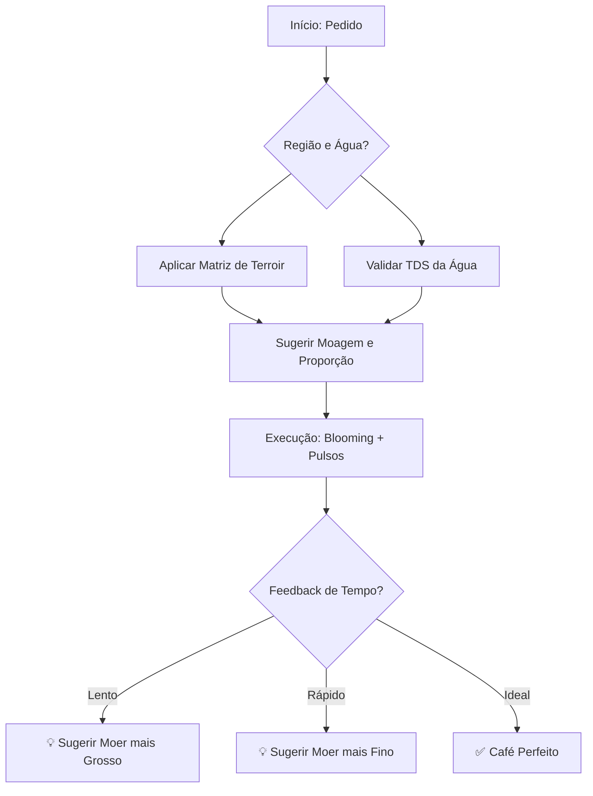

# 📖 Guia de Uso: Advanced Brazilian Coffee Engine (v2.1)

Esta skill orquestra o preparo de cafés especiais brasileiros, unindo a ciência da extração com a arte do barismo.

## 🔄 Fluxo de Inteligência
Abaixo, o diagrama que mostra como o agente processa as variáveis técnicas e químicas:



---

## 🚀 Exemplos de Competência Avançada

### 1. Diagnóstico de Extração em Tempo Real
**O que pedir:** *"Preparei 300ml de Cerrado com 20g de café, mas a extração demorou 5 minutos."*

**O que acontece:**
O agente detecta que o tempo ideal é entre 3-4 minutos. 
- **Diagnóstico:** "⚠️ Fluxo muito lento. Sugestão: Use uma moagem mais GROSSA para facilitar a passagem."

---

### 2. Controle de Qualidade da Água (Sommelier Mode)
**O que pedir:** *"Vou usar uma água com 250 ppm de minerais para fazer um Mogiana."*

**O que acontece:**
O agente acessa a base de química da água.
- **Feedback:** "⚠️ Água muito dura (250 ppm). Isso pode neutralizar a acidez do seu Mogiana e gerar um sabor amargo e 'chapado'."

---

### 3. Modo Científico (Integração CLI)
Para monitoramento e logs estruturados, utilize os novos parâmetros de diagnóstico:

**Comando:**
```bash
python scripts/validar_cafe.py --ml 400 --regiao sul_de_minas --tempo 150 --tds_agua 40 --json
```

**Saída JSON com Insights:**
```json
{
  "regiao": "sul_de_minas",
  "cafe_g": 28.6,
  "temp_alvo": 90,
  "moagem_ideal": "Média-Grossa",
  "avisos_barista": [
    "Água muito pura (mole). Café pode ficar sem corpo.",
    "⚠️ Fluxo muito rápido. Sugestão: Use uma moagem mais FINA para aumentar a resistência."
  ]
}
```

---

## 🛠️ Manutenção e Expansão
- **Adicionar Regiões:** Edite a matriz `TERROIRS` em `SKILL.md` e `validar_cafe.py`.
- **Ajustar Regras:** As faixas de TDS de água e tempos de extração podem ser calibradas no arquivo `scripts/validar_cafe.py`.
