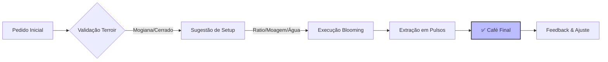
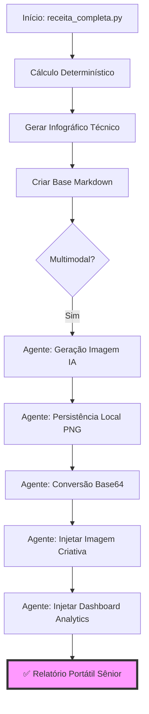

# 📖 Guia de Uso: Advanced Brazilian Coffee Engine (v5.0.0)

Esta skill orquestra o preparo de cafés especiais brasileiros, unindo a ciência da extração com a arte do barismo técnico e portabilidade total.

## 🔄 Fluxo de Inteligência (Engine Lifecycle)

O diagrama abaixo ilustra o ciclo de vida de uma extração, desde o pedido inicial até a entrega de alto impacto.



---

## ⚙️ Engenharia de Escala & Portabilidade

A v5.0 utiliza uma arquitetura de injeção sequencial para garantir a portabilidade total dos artefatos.

### Fluxo de Empacotamento Sênior (Base64 Dual-Image)



---

## 🏗️ Padrão Sênior de Portabilidade

A v5.0 introduz o **Padrão Sênior de Portabilidade**, garantindo que cada extração resulte em um artefato autossuficiente e offline-ready.

### 🌟 O "Super Markdown" (.md)
O documento gerado em `.ia/output/receita_*.md` é o rastro definitivo da experiência, unificando:
1.  **Storytelling & Humor:** No topo, contextualizando a extração ao cenário de dev.
2.  **Infográfico Técnico:** Codificado em **Base64** (sem dependência de arquivo local).
3.  **Imagem Criativa IA:** Gerada nativamente e embutida em **Base64**.
4.  **Auditoria de Impacto:** Dashboard de histórico do time embutido em **Base64** como seção final.

---

## 📊 Barista Analytics (Auditoria de Alto Impacto)

A skill monitora o pulso do time através do consumo. O módulo de Analytics agora oferece interpretação narrativa.

### Como gerar seu Relatório de Impacto?
Você pode solicitar uma auditoria a qualquer momento via o runtime canônico:

**Comando:**
```bash
python3 scripts/receita_completa.py --dashboard
```

**O que o relatório entrega:**
*   **Interpretação Sênior:** Análise do estado do time (ex: "Modo Incêndio", "Estável").
*   **KPIs Visuais:** Gráficos de volume, grãos e impacto humano.
*   **Portabilidade:** Gráfico incorporado em Base64 no relatório portátil.

---

## 🚀 Como Usar (Prompt-First)

### 1. Runtime Canônico (Fluxo Recomendado)
Para qualquer receita, visualização ou auditoria, use o ponto de entrada canônico. Ele garante a integridade de todos os artefatos.

**Comando:**
```bash
python3 scripts/receita_completa.py --cenario security --pessoas 15
```

### 2. Fechamento Multimodal Nativo
No padrão v5.0, o Agente possui autonomia para finalizar o ciclo:
1.  O script gera o prompt e o manifesto (`pending_multimodal`).
2.  O Agente gera a imagem IA e a salva localmente.
3.  O Agente injeta as imagens em Base64 no Markdown e atualiza o manifesto para `ok`.

---

## 🔡 Dicionário Técnico da Interface

| Parâmetro | Tipo | Obrigatório | Descrição |
| :--- | :--- | :--- | :--- |
| `--cenario` | `enum` | Sim* | Contexto (planning, security, incident, etc). |
| `--pessoas` | `int` | Sim* | Número de pessoas (aciona Auto-Scaling). |
| `--dashboard` | `bool` | Não | Gera Auditoria de Impacto em vez de receita. |
| `--ml` | `int` | Não | Volume de água (inferido por pessoas se ausente). |

*\*Obrigatórios a menos que `--dashboard` seja utilizado.*

---

## 🛤️ Lean Telemetry
A rastreabilidade foi simplificada para reduzir o ruído visual e técnico:
*   **Arquivo Único:** `flow_trace_*.json` contendo todo o rastro estruturado.
*   **Auditoria Discreta:** Link para o rastro JSON inserido apenas no rodapé do Markdown.

---

## 🛠️ Stack Tecnológica
*   **Python 3.8+ & Pillow:** Motor de cálculo e renderização UI.
*   **Base64 Encoding:** Estratégia de portabilidade para artefatos multimodais.
*   **Conventional Commits:** Histórico de evolução padronizado.

---
*Desenvolvido seguindo os padrões de [AgentSkills.io](https://agentskills.io/specification)*
