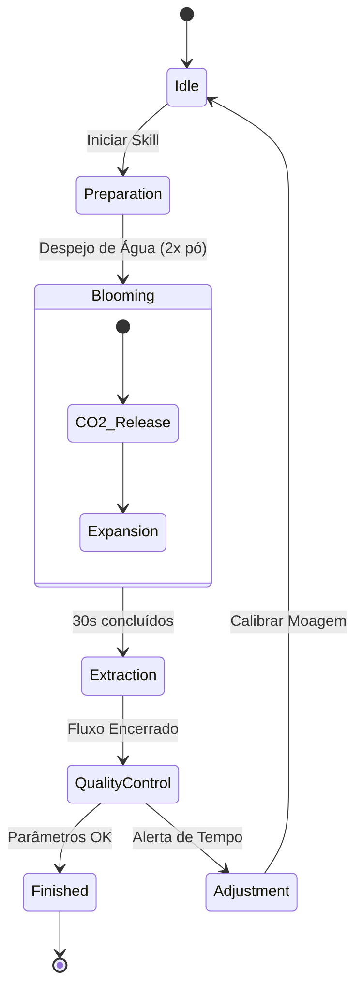
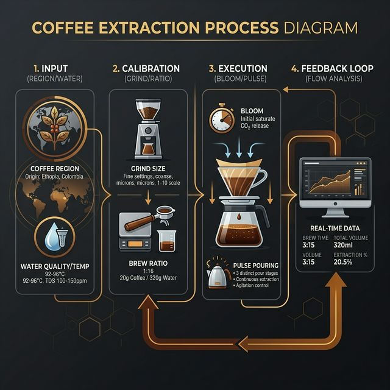

# 📖 Guia de Uso: Advanced Brazilian Coffee Engine (v2.1)

Esta skill orquestra o preparo de cafés especiais brasileiros, unindo a ciência da extração com a arte do barismo.

## 🔄 Fluxo de Inteligência (Engine Lifecycle)

O diagrama abaixo ilustra o ciclo de vida de uma extração. Este formato em **Unicode Art** garante a visualização correta em qualquer editor, terminal ou ambiente Git.

```text
┌────────────────┐     ┌──────────────────┐     ┌─────────────────────┐
│ Pedido Inicial │────▶│ Validação Terroir│────▶│ Sugestão de Setup   │
└────────────────┘     └─────────┬────────┘     └──────────┬──────────┘
                                 │                         │ 
                       (Mogiana/Cerrado)        (Ratio/Moagem/Água)
                                 │                         │
                                 ▼                         ▼
┌────────────────┐     ┌──────────────────┐     ┌─────────────────────┐
│ ✅ Café Final  │◀────│ Feedback Tempo   │◀────│ Execução Blooming   │
└────────────────┘     └─────────┬────────┘     └─────────────────────┘
                                 │
                        (Lento/Rápido?)
                                 │
                                 ▼
                       [Ajuste de Moagem]
```

### 🧠 Visão de Estados (Complementar)

Para visualizadores que suportam Mermaid (GitHub/VS Code):



> 🖼️ **Visual Check:** Para uma visão detalhada do processo de barismo, consulte o infográfico em: `assets/flowchart.png`



---

## 🚀 Como Usar (Prompt-First)

A forma recomendada de usar esta skill é através da **interface de chat** com o Agente de IA. O agente utiliza o `SKILL.md` como cérebro para entender seu pedido.

### 1. Pedido Simples
**Prompt:** *"Pode me sugerir e explicar como fazer 300ml de café da região Mogiana?"*

### 2. Pedido Baseado em Cenário (Consultoria)
**Prompt:** *"Estou em uma sessão crítica de debugging e preciso de café para 2 pessoas (400ml). O que você sugere?"*
> O agente identificará o cenário, sugerirá o grão **Cerrado**, calculará as gramas exatas e fornecerá um insight de humor sobre o bug.

### 3. Ajuste de Extração
**Prompt:** *"Meu último café demorou 5 minutos para filtrar e ficou amargo. Como ajusto a moagem para 300ml de Sul de Minas?"*

---

## ✅ Verificação Técnica e Automação

Para desenvolvedores que desejam validar a lógica de forma determinística ou integrar a skill em pipelines, o motor de cálculo pode ser invocado via terminal:

**Comando de Validação:**
```bash
python3 scripts/validar_cafe.py --ml 250 --cenario debugging --json
```

**Saída Estruturada (Contrato):**
```json
{
  "cenario": "debugging",
  "regiao": "cerrado",
  "cafe_g": 16.7,
  "temp_alvo": 94,
  "moagem_ideal": "Média",
  "insight_dev": "Se o bug for um NullPointerException...",
  "avisos_barista": []
}
```

---

## 🤖 O Agente Autônomo: Validação nos Bastidores

Nesta skill, a IA não é apenas um chatbot; ela é um **operador técnico**. Veja como o Agente utiliza o motor de validação de forma autônoma:

### Cenário: "O Sentinela do Café" (Double-Check Automático)

*O desenvolvedor pede um café para uma sessão de debugging, mas menciona que a água acabou de ferver.*

1.  **O Gatilho:** Você diz: *"Barista, vou fazer um café para debugging agora. A água já ferveu, posso colocar?"*
2.  **A Análise Interna:** O Agente lê seu pedido e identifica o risco térmico (água fervente). No `SKILL.md`, ele vê que existe uma ferramenta de validação.
3.  **A Execução Silenciosa (Tool Call):** Antes de te responder, o Agente executa internamente:
    ```bash
    python3 scripts/validar_cafe.py --ml 300 --cenario debugging --temp 100 --json
    ```
4.  **O Processamento do Erro:** O script retorna um JSON informando: `"status": "FAILED", "errors": ["Água fervente detectada..."]`.
5.  **A Resposta Inteligente:** Em vez de apenas dizer "não use água quente", o Agente entrega uma solução embasada:
    > "Espere um momento! Acabei de rodar meu motor de validação e detectamos que 100°C vai queimar seu Cerrado. Deixe a água descansar por 60 segundos para atingirmos os 94°C ideais para o seu debugging. Enquanto isso, prepare os 25g de café."

*Este ciclo demonstra o Agente usando **Raciocínio + Ferramenta** para evitar falhas no mundo real.*

---

## 🎭 A Jornada do Café: O Ciclo de Vida do Desenvolvedor

Na engenharia de software, o café não é apenas energia; é um **estado mental**. Esta skill foi desenhada para acompanhar as flutuações de foco do seu time.

### 🧪 Cenário 1: O Sprint Planning (Equilíbrio e Foco)
*O time está reunido, as tasks ainda são estimativas e o backlog está limpo.*
*   **Necessidade:** Um café que traga clareza mental e doçura para as discussões críticas.
*   **Comando:** `"Barista, prepare uma Mogiana equilibrada para 6 pessoas (900ml)."`
*   **O Agente responde:** 
    > "Iniciando modo Planning. Aplicando Ratio 1:12 para destacar a doçura e notas de chocolate. Vamos calibrar para 75g de café moagem média-fina. Uma base sólida para um sprint promissor."

### 🐛 Cenário 2: O Bug em Produção (Resiliência e Punch)
*São 14h, um erro 500 está subindo nos logs e o time entrou em 'war room'.*
*   **Necessidade:** Intensidade, corpo e resistência. Um café que sustente o raciocínio sob pressão.
*   **Comando:** `"Preciso de um Cerrado intenso, 300ml, moagem para punch extra."`
*   **O Agente responde:**
    > "Modo War Room ativado. Reduzindo ratio para 1:11 e elevando temperatura para 94°C para extrair o máximo de corpo do Cerrado Mineiro. Diagnóstico extra: Verifique o TDS da água para evitar amargor excessivo sob alta temperatura."

### 🚀 Cenário 3: O Deploy de Sexta (Celebração e Nuances)
*A feature foi lançada, os testes passaram e o merge foi feito. Hora de apreciar a vitória.*
*   **Necessidade:** Complexidade sensorial. Um café ácido e vibrante para um momento de descontração.
*   **Comando:** `"Celebração: Sul de Minas, perfil frutado para um 'Done' bem feito."`
*   **O Agente responde:**
    > "Launch Mode! Aplicando a técnica de Sul de Minas (Ratio 1:15, 90°C). Vamos focar na acidez cítrica e corpo leve. Este é um café para ser apreciado lentamente enquanto os logs estabilizam no dashboard de monitoramento."

---

## 🛠️ Manutenção e Expansão

- **Adicionar Regiões:** Edite a matriz `TERROIRS` em `SKILL.md` e `validar_cafe.py`.
- **Ajustar Regras:** As faixas de TDS de água e tempos de extração podem ser calibradas no arquivo `scripts/validar_cafe.py`.
