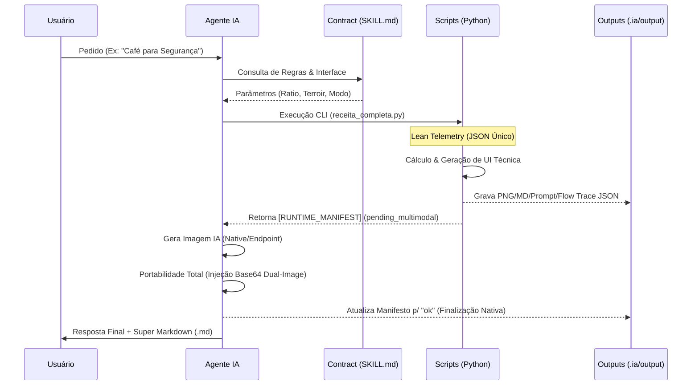
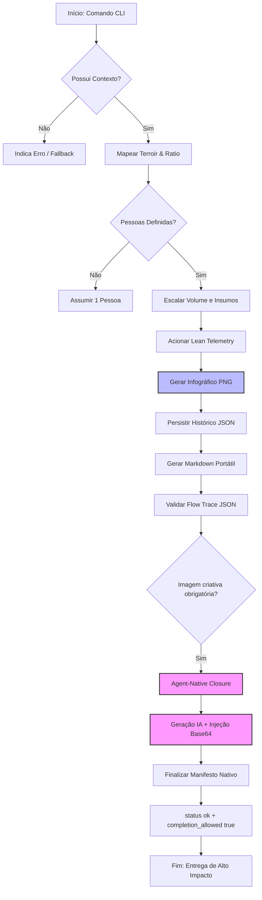

# ☕ Projeto CAFE: Onde o Código encontra o Terroir
### *(A Demonstração Suprema do Poder das Agent Skills)*

> **"Não é apenas café. É Engenharia de Extração Assistida por IA."**  
> — *Algum Arquiteto Sênior antes de um Deploy às 17h.*

## 📐 Arquitetura Visual e Ciclo de Vida

Para compreender o fluxo de ponta a ponta desta skill, observe como o Agente orquestra cada componente sob o **Padrão Sênior de Portabilidade**.

### 1. Sequenciamento de Execução (Multimodal Native)
O Agente orquestra o ciclo de vida completo, desde o cálculo técnico até a injeção final de artefatos.

### 2. Lógica de Decisão e Auto-Scaling
O motor técnico (`validar_cafe.py`) opera como uma máquina de estados que valida o contexto antes da extração.

### 🎓 Guia de Leitura Arquitetural (Para Desenvolvedores)

Se você é novo no projeto, aqui está como interpretar a nossa engenharia baseada nestes diagramas e no novo **Padrão Sênior v5.0**:

1.  **O Orquestrador (Agente IA):** Diferente de um bot comum, o Agente atua como um **Gerente de Intenção**. Ele lê o contrato (`SKILL.md`) e decide quais parâmetros passar para o motor técnico. Ele também é o responsável final pelo **Fechamento Nativo**, injetando a imagem IA e o dashboard em Base64 para garantir a portabilidade total.
2.  **O Nó Híbrido (Scripts Python):** Os scripts realizam a "pesquisa científica" (matemática de extração) e a renderização técnica. O caminho recomendado é o `scripts/receita_completa.py`, que unifica o cálculo, a geração do infográfico e o **Lean Telemetry**.
3.  **Lean Telemetry (JSON Único):** Eliminamos o ruído visual de múltiplos logs. Toda a rastreabilidade da execução está consolidada em um único arquivo JSON estruturado, servindo tanto para auditoria técnica quanto para o histórico do Analytics.
4.  **Portabilidade via Base64:** A escolha técnica de embutir todas as imagens (Infográfico, Arte IA e Dashboard) via Base64 no Markdown elimina dependências de arquivos externos, transformando o `.md` em um artefato robusto pronto para compartilhamento instantâneo.

---

## 🚀 Principais Inovações Técnicas (v5.0)

Este projeto demonstra como transformar um Agente de IA em um especialista técnico capaz de realizar ações reais e portáteis seguindo o padrão **[Agent Skills](https://agentskills.io/home)**.

### ✨ Superpoderes da Skill `receita-cafe`:
*   **Portabilidade Total (Super Markdown):** Gera documentos autossuficientes com storytelling, infográfico técnico, imagem IA e dashboard de impacto, tudo integrado via **Base64 Dual-Image**.
*   **Analytics de Alto Impacto:** Sistema de auditoria que interpreta o pulso do time (estresse vs. café) com storytelling narrativo e humor barista.
*   **Fechamento Nativo (UX Sênior):** O Agente orquestra o ciclo multimodal completo sem dependência de gates manuais ou scripts externos de finalização.
*   **Lean Telemetry:** Rastreabilidade simplificada em arquivo JSON único, eliminando redundância e focando no rastro de auditoria essencial.
*   **Auto-Scaling de Dose:** Inferência inteligente de volume e insumos baseado no quorum (de 1 pessoa a auditórios de 30+).

---

## 🛠️ Como rodar a demonstração?

### Comece por Intenção
| Sua intenção | Caminho recomendado | Exemplo |
| :--- | :--- | :--- |
| Quero só uma sugestão no chat | Prompt natural para o agente | `"Sugira um café para reunião de arquitetura com 6 pessoas."` |
| Quero entrega completa com portabilidade | `receita_completa.py` (recomendado) | `python3 scripts/receita_completa.py --cenario planning --pessoas 6` |
| Quero auditoria de alto impacto | `--dashboard` | `python3 scripts/receita_completa.py --dashboard` |
| Quero testar cálculo técnico isolado | `validar_cafe.py` | `python3 scripts/validar_cafe.py --cenario debugging --pessoas 2 --flow --imagem --markdown` |

**Regra de Ouro:** O Agente realiza a **Finalização Nativa**: gera imagem IA, baixa fisicamente e injeta no Markdown em Base64. A resposta final só é liberada quando o manifesto atingir o estado `ok`.

---
*Este projeto foi criado para inspirar. O futuro é modular, portátil e bem extraído.* 🚀☕

---
*Desenvolvido seguindo os padrões de [AgentSkills.io](https://agentskills.io/specification)*
