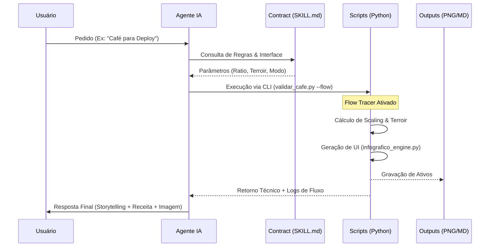
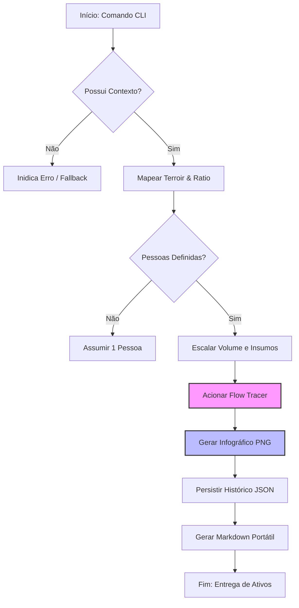

# ☕ Projeto CAFE: Onde o Código encontra o Terroir
### *(A Demonstração Suprema do Poder das Agent Skills)*

> **"Não é apenas café. É Engenharia de Extração Assistida por IA."**  
> — *Algum Arquiteto Sênior antes de um Deploy às 17h.*

## 📐 Arquitetura Visual e Ciclo de Vida

Para compreender o fluxo de ponta a ponta desta skill, observe como o Agente orquestra cada componente.

### 1. Sequenciamento de Execução
O Agente não atua isolado. Ele utiliza o contrato `SKILL.md` como guia para invocar ferramentas determinísticas.

### 2. Lógica de Decisão e Auto-Scaling
O motor técnico (`validar_cafe.py`) opera como uma máquina de estados que valida o contexto antes da extração.

### 🎓 Guia de Leitura Arquitetural (Para Desenvolvedores)

Se você é novo no projeto, aqui está como interpretar a nossa engenharia baseada nestes diagramas:

1.  **O Despachante (Agente IA):** Ele não "inventa" receitas. Ele atua como um gerente de projeto que lê o contrato (`SKILL.md`) e decide quais parâmetros passar para o motor técnico.
2.  **O Flow Tracer (Nó Rosa):** Este é o nosso diferencial didático. Quando ativo, ele obriga o código a revelar seu estado interno e quais arquivos estão sendo acessados. É o equivalente a um modo `DEBUG` que ensina enquanto executa.
3.  **O Rendering Engine (Nó Azul):** Demonstra a separação de responsabilidades. O cálculo técnico é puramente lógico, enquanto a renderização do infográfico é delegada a um módulo especialista em UI.

---

## 🧠 O Cérebro Híbrido: Heurística (IA) vs. Determinismo (Script)

Uma dúvida comum em projetos de IA é: *"Quem realmente decide os parâmetros do café?"*. No padrão Agent Skills, utilizamos uma arquitetura de responsabilidade compartilhada.

| Atividade | Responsável | Tipo de Inteligência | Por que? |
| :--- | :--- | :--- | :--- |
| **Interpretação de Contexto** | Agente IA | **Heurística** (Criativa) | A IA identifica nuances no pedido humano (ex: tensão, deploy, cansaço). |
| **Mapeamento de Cenário** | Agente IA | **Contextual** (Lógica) | A IA escolhe o cenário (`incident`, `planning`) baseado no `SKILL.md`. |
| **Cálculo de Proporção (Ratio)** | Script Python | **Determinística** (Científica) | O código Python garante que a física da extração seja matematicamente correta. |
| **Validação Térmica (QA)** | Script Python | **Determinística** (Lógica) | O script impede que a temperatura fuja dos limites seguros para o grão. |
| **Narrativa e Storytelling** | Agente IA | **Criativa** (Narrativa) | A IA utiliza o `prompt_imagem_template.md` para criar a atmosfera da receita. |

> **Conclusão Didática:** A IA decide o **"O Quê"** e o **"Por Quê"** (Contexto), enquanto o Python garante o **"Como"** (Precisão Técnica). Isso evita alucinações técnicas e garante um café sempre perfeito.

---

## 🚀 Principais Inovações Técnicas (v4.1)

Bem-vindo ao **Projeto CAFE**! Este repositório nasceu para responder a uma pergunta fundamental da era da IA:  
*"Como transformamos um Agente de IA em um especialista técnico capaz de realizar ações reais, precisas e visuais?"*

A resposta? **[Agent Skills](https://agentskills.io/home)**.

Este projeto não é apenas um "gerador de receitas". É um **Proof of Concept (PoC)** de alta fidelidade que demonstra como estender as capacidades de uma IA de forma modular, segura e profissional.

---

## 🧠 A Estrela do Show: Skill `receita-cafe`

Nossa flagship skill, a `receita-cafe`, é o exemplo perfeito de como uma "Skill" deve ser estruturada. Ela não apenas dá conselhos; ela orquestra variáveis complexas de barismo e engenharia de software simultaneamente.

### ✨ Superpoderes da Skill:
*   **Auto-Scaling de Dose:** Precisa de café para uma pessoa ou para uma reunião de 15 líderes? A IA infere o volume e aplica o *Ratio* técnico correto.
*   **Self-Healing (Auto-Setup):** A skill detecta se o ambiente tem as dependências (Pillow) e se auto-configura na primeira execução. É o fim do *"na minha máquina não funciona"*.
*   **Observabilidade (Barista Analytics):** Um sistema de telemetria que rastreia o consumo por cenário e gera dashboards de estresse do time.
*   **Rastreabilidade Didática (Flow Tracer):** O fim da "caixa-preta". A skill detalha cada decisão técnica em tempo real, do contrato ao PNG.
*   **Output Multimodal:** Gera documentos Markdown portáteis e infográficos visuais de alto impacto prontos para apresentação.

---

## 🔡 Dicionário Técnico da Interface (`SKILL.md`)

Para que o Agente opere com precisão cirúrgica, ele utiliza a interface definida no contrato YAML. Abaixo, detalhamos cada parâmetro técnico para facilitar a sua compreensão do "Cérebro" da Skill:

### 📥 Parâmetros de Entrada (Input)

| Propriedade YAML | Tipo | Padrão (Default) | Descrição Didática |
| :--- | :--- | :--- | :--- |
| **`volume_ml`** | `integer` | *Obrigatório* | O volume de água total. Mínimo de 150ml (uma dose padrão). |
| **`regiao`** | `enum` | `generico` | A origem botânica. Define a **Matriz Termodinâmica** (Razão/Temperatura/Moagem). |
| **`cenario`** | `enum` | `planejamento` | O contexto do time. Influencia o **Storytelling** e o visual do infográfico. |
| **`intensidade`** | `enum` | `equilibrado` | Opções: `suave`, `equilibrado`, `intenso`. Ajusta the ratio para mais ou menos corpo. |
| **`num_pessoas`** | `integer` | `1` | O multiplicador de escala. Aciona a **Engine de Auto-Scaling** de insumos. |
| **`moagem_ajustavel`** | `boolean` | `true` | Permite que o sistema sugira correções baseadas em sintomas de extração. |
| **`dashboard`** | `boolean` | `false` | Se `true`, invoca a a engine de **Barista Analytics** em vez de uma receita. |
| **`flow`** | `boolean` | **`true`** | **O Modo Didático.** Exibe a rastreabilidade passo a passo. Mantido ativo para fins educativos. |

### 📤 Estrutura de Saída (Output)

O sistema não entrega apenas texto, ele entrega um **Objeto de Conhecimento**:
*   **`parametros_finais`**: O JSON calculado com as gramas exatas de café e temperatura.
*   **`alerta_qa`**: Um array de strings com avisos técnicos (ex: dependência de água mineral, alerta térmico).
*   **`image_path`**: O caminho absoluto para o arquivo PNG do infográfico gerado na pasta `/output`.

---

## 🏗️ Por que "Agent Skills"?

As Agent Skills representam uma mudança de paradigma. Em vez de prompts soltos, temos:
1.  **Contratos Claros (`SKILL.md`):** O Agente sabe exatamente o que pode e o que não pode fazer.
2.  **Lógica Isolada (`scripts/`):** O código técnico é separado da conversação.
3.  **Memória e Persistência (`data/`):** O Agente aprende com o histórico.
4.  **Storytelling Visual:** Integração com IAs gerativas para criar cenas narrativas que conectam o café ao seu momento de dev (Deploy, War Room, Planning).

---

## 📖 Mergulhe na Documentação Técnica

Se você é um desenvolvedor, arquiteto ou um entusiasta de automação, o verdadeiro "ouro" está nos detalhes. Confira a especificação completa da nossa skill principal:

👉 **[Documentação Técnica: Skill Receita-Café](.agents/skills/receita-cafe/README.md)**

---

## 🎭 Storytelling: A Jornada do Barista-Dev

Neste projeto, tratamos cada xícara como um **Release Note**.
*   Um bug em produção? Ativamos o **Modo War Room** (Cerrado Intenso).
*   Um alinhamento de times? Ativamos o **Modo Team Topologies** (Chapada Diamantina).
*   Um deploy de sucesso? É hora do **Modo Launch** (Sul de Minas Frutado).

Aqui, a cafeína é o combustível e as **Agent Skills** são o motor que garante que cada gota seja extraída com precisão de microssegundos.

---

## 🛠️ Como rodar a demonstração?

Se você já tem o Agente configurado, basta um pedido simples e natural para ver a magia acontecer:

> *"Barista, preciso de um café intenso para uma **War Room de incidente crítico** com 8 pessoas!"*

*(O Agente entenderá automaticamente que deve escalar a receita para o grupo, aplicar os parâmetros de resiliência e, por padrão, exibirá o **Flow Tracer** passo a passo, gerando o infográfico visual no processo).*

---
*Este projeto foi criado para inspirar. Se você achava que Agentes de IA eram apenas sobre texto, pegue uma xícara de café e explore o código. O futuro é modular.* 🚀☕

---
*Desenvolvido seguindo os padrões de [AgentSkills.io](https://agentskills.io/specification)*
